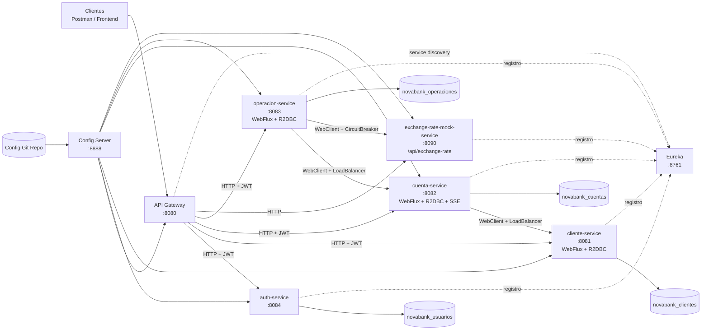
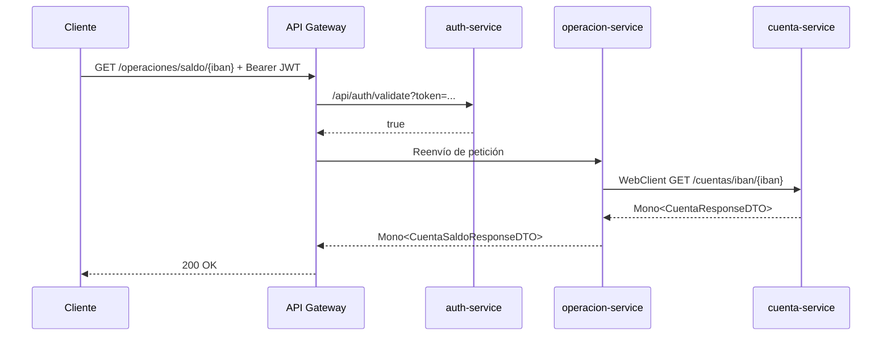
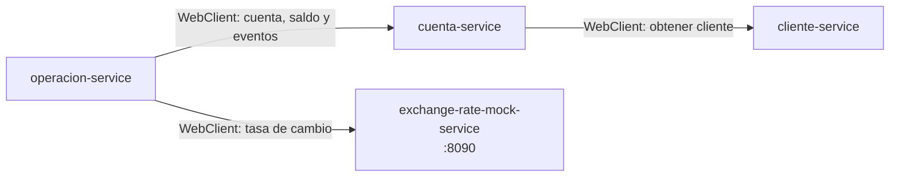
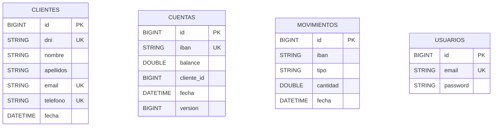
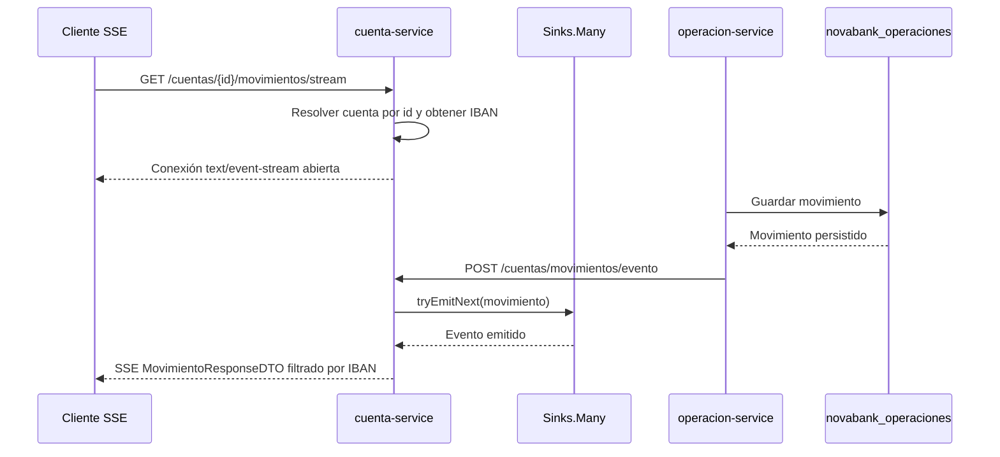

# NovaBank - Plataforma de Microservicios Reactivos (Módulo 5)

NovaBank es un backend bancario evolucionado desde una aplicación CLI hasta una plataforma de microservicios reactivos. El estado actual consolida una arquitectura no bloqueante basada en Spring WebFlux, Project Reactor, R2DBC, WebClient, Service Discovery, configuración centralizada, seguridad JWT y resiliencia ante fallos parciales.

## 1. Contexto de migración

El README mantiene el histórico de la evolución técnica del proyecto para reflejar las decisiones arquitectónicas acumuladas:

| Módulo | Etapa | Enfoque técnico |
|---|---|---|
| Módulo 1 | CLI + memoria | Primer modelo de dominio bancario, estructuras en memoria y operaciones básicas. |
| Módulo 2 | CLI + JDBC + PostgreSQL | Persistencia relacional, SQL explícito y conexión directa a PostgreSQL. |
| Módulo 3 | Monolito REST con Spring Boot | Exposición HTTP, capas controller/service/repository y API REST centralizada. |
| Módulo 4 | Microservicios síncronos | Separación por contexto, API Gateway, Eureka, Config Server, OpenFeign, JPA y resiliencia inicial. |
| Módulo 5 | Ecosistema reactivo | Migración a WebFlux, Project Reactor, R2DBC, WebClient, SSE y política fail-fast en operaciones financieras críticas. |

## 2. Topología de servicios

| Servicio | Puerto | Rol | Responsabilidad | Propiedad de datos |
|---|---:|---|---|---|
|  | 8761 | Infraestructura | Registro y descubrimiento de servicios | N/A |
|  | 8888 | Infraestructura | Configuración centralizada por entorno | N/A |
|  | 8080 | Infraestructura | Punto único de entrada, enrutado y filtro JWT | N/A |
|  | 8084 | Seguridad | Autenticación, emisión y validación de token | `novabank_usuarios` |
|  | 8081 | Negocio | Gestión del ciclo de vida de clientes | `novabank_clientes` |
|  | 8082 | Negocio | Gestión de cuentas, saldos y streaming SSE de movimientos | `novabank_cuentas` |
|  | 8083 | Negocio | Depósitos, retiros, transferencias, movimientos y conversión de divisas | `novabank_operaciones` |
|  | 8090 | Soporte | Simulación reactiva de tasas de cambio para pruebas de integración y resiliencia | N/A |

## 3. Stack tecnológico

| Capa | Tecnología + versión | Notas |
|---|---|---|
| Lenguaje |  | Baseline del proyecto definido en el parent `pom.xml`. |
| Framework core |  | Parent BOM común para los módulos. |
| Ecosistema cloud |  | Discovery, Config, Gateway y LoadBalancer. |
| Capa web histórica |  | Base del monolito y de la primera etapa de microservicios. |
| Capa web reactiva |  | Controladores no bloqueantes con `Mono` y `Flux`. |
| Programación reactiva |  | Composición asíncrona, backpressure y streams SSE. |
| Descubrimiento |  | Resolución dinámica de endpoints. |
| Configuración centralizada |  | Configuración remota desde repositorio Git. |
| Edge/API |  | Ruteo y filtro de autenticación. |
| Comunicación histórica |  | Clientes HTTP declarativos usados en la etapa síncrona. |
| Comunicación actual |  | Sustituye Feign para llamadas HTTP no bloqueantes entre servicios. |
| Resiliencia |  | Circuit Breaker en dependencias críticas y fallback controlado. |
| Seguridad |  | JWT stateless. |
| Persistencia histórica |  | Persistencia bloqueante usada antes de la migración reactiva. |
| Persistencia actual |  | Repositorios reactivos y transacciones no bloqueantes. |
| Driver PostgreSQL |  | Driver no bloqueante para PostgreSQL. |
| Base de datos runtime |  | Aislamiento por contexto y base de datos por servicio. |
| Base de datos testing |  | Pruebas reactivas en memoria sin Docker/Testcontainers. |
| Testing histórico |  | Unit, slice, integración y contrato en la etapa MVC/Feign. |
| Testing reactivo |  | Validación de endpoints WebFlux, flujos Reactor e integraciones externas. |

## 4. Diagramas de arquitectura

### 4.1 Arquitectura global reactiva



### 4.2 Flujo de petición autenticada



### 4.3 Dependencias entre servicios



### 4.4 Modelo ER (database-per-service)



## 5. API Gateway y seguridad

Las rutas se centralizan en `C:/novabank-config-repo/api-gateway.yml`.

| Route ID | Path Predicate | Target URI | Filtro |
|---|---|---|---|
| `auth-service-route` | `/api/auth/**` | `lb://auth-service` | ninguno |
| `cliente-service-route` | `/clientes/**` | `lb://cliente-service` | `AuthenticationFilter` |
| `cuenta-service-route` | `/cuentas/**` | `lb://cuenta-service` | `AuthenticationFilter` |
| `operacion-service-route` | `/operaciones/**`, `/consultas/**` | `lb://operacion-service` | `AuthenticationFilter` |
| `exchange-service-route` | `/exchange/**`, `/api/exchange-rate/**` | `lb://exchange-rate-mock-service` | ninguno |

Flujo JWT:

1. El cliente obtiene token con `POST /api/auth/login`.
2. El cliente envía `Authorization: Bearer <jwt>` al Gateway.
3. El Gateway valida el token contra `auth-service /api/auth/validate`.
4. Si es válido, enruta al microservicio destino; si no, responde `401`.

## 6. Endpoints por microservicio

### auth-service (`/api/auth`)

| Método | Endpoint | Descripción |
|---|---|---|
| `POST` | `/api/auth/login` | Autentica usuario y devuelve JWT. |
| `POST` | `/api/auth/register` | Registra usuario. |
| `GET` | `/api/auth/validate?token=...` | Valida token. |

### cliente-service (`/clientes`)

| Método | Endpoint | Descripción |
|---|---|---|
| `POST` | `/clientes` | Crea cliente. |
| `GET` | `/clientes` | Lista clientes. |
| `GET` | `/clientes/{id}` | Busca cliente por ID. |
| `GET` | `/clientes/dni/{dni}` | Busca cliente por DNI. |
| `DELETE` | `/clientes/{id}` | Elimina cliente. |

### cuenta-service (`/cuentas`)

| Método | Endpoint | Descripción |
|---|---|---|
| `POST` | `/cuentas?clienteId={id}` | Crea cuenta para cliente. |
| `GET` | `/cuentas/cliente/{idCliente}` | Lista cuentas por cliente. |
| `GET` | `/cuentas/iban/{iban}` | Obtiene cuenta por IBAN. |
| `PUT` | `/cuentas/iban/{iban}/saldo?nuevoSaldo={valor}` | Actualiza saldo de una cuenta (uso interno). |
| `PUT` | `/cuentas/saldos` | Actualiza saldos de origen y destino en una transferencia (uso interno). |
| `GET` | `/cuentas/{id}/movimientos/stream` | Stream SSE de movimientos de una cuenta. |
| `POST` | `/cuentas/movimientos/evento` | Publica un evento interno de movimiento en el sink SSE. |

### operacion-service (`/operaciones`)

| Método | Endpoint | Descripción |
|---|---|---|
| `POST` | `/operaciones/deposito` | Realiza depósito. |
| `POST` | `/operaciones/retiro` | Realiza retiro. |
| `POST` | `/operaciones/transferencia` | Realiza transferencia, incluyendo conversión de divisa si procede. |
| `GET` | `/operaciones/movimientos/{iban}` | Lista movimientos, admite `fechaInicio` y `fechaFin`. |
| `GET` | `/operaciones/saldo/{iban}` | Consulta saldo. |

### exchange-rate-mock-service (`/api/exchange-rate`)

| Método | Endpoint | Descripción |
|---|---|---|
| `GET` | `/api/exchange-rate?from={moneda}&to={moneda}` | Devuelve una tasa simulada de cambio. |
| `GET` | `/api/exchange-rate?from={moneda}&to={moneda}&delay=true` | Simula latencia para validar timeout, Circuit Breaker y fallback fail-fast. |

Nota: para consumo externo, la entrada recomendada es siempre `api-gateway`.

## 7. Módulo 5 - Migración al Stack Reactivo

### 7.1 Transición a WebFlux

Los servicios de negocio fueron migrados a Spring WebFlux. Los controladores ya no exponen respuestas bloqueantes, sino tipos reactivos `Mono<T>` para respuestas unitarias y `Flux<T>` para colecciones o streams.

Esta transición permite que los hilos del servidor no queden bloqueados mientras esperan I/O de red o base de datos. En una arquitectura bancaria con llamadas entre microservicios, esta característica mejora la escalabilidad bajo concurrencia, especialmente en operaciones que consultan cuenta, cliente, movimientos o tasas externas.

Ejemplos actuales:

| Servicio | Ejemplo | Tipo reactivo |
|---|---|---|
| `cliente-service` | Crear, consultar y eliminar clientes | `Mono` / `Flux` |
| `cuenta-service` | Crear cuenta, consultar cuenta, listar cuentas y emitir SSE | `Mono` / `Flux` |
| `operacion-service` | Depósito, retiro, transferencia, saldo y movimientos | `Mono` / `Flux` |
| `exchange-rate-mock-service` | Consulta simulada de tasa de cambio | `Mono` |

### 7.2 Persistencia no bloqueante

La persistencia de los servicios de negocio se migró de Spring Data JPA/Hibernate a Spring Data R2DBC. Esto elimina el bloqueo de hilos asociado a JDBC y permite que la cadena HTTP, lógica de negocio y acceso a datos mantenga un modelo no bloqueante de extremo a extremo.

La integridad transaccional se conserva con `@Transactional` aplicado sobre métodos que devuelven `Mono` o `Flux`. Spring gestiona la transacción reactiva dentro de la suscripción, no en el hilo llamante.

Casos relevantes:

| Operación | Garantía |
|---|---|
| `CuentaService.actualizarSaldo` | Actualiza de forma transaccional el saldo de una cuenta. |
| `CuentaService.actualizarSaldos` | Actualiza saldo origen y destino componiendo ambas cuentas con `Mono.zip`. |
| `OperacionService.transferir` | Orquesta consulta de cuentas, tasa de cambio, actualización de saldos y persistencia de movimientos en flujo reactivo. |
| `OperacionService.depositar` y `OperacionService.retirar` | Persisten movimiento después de actualizar el saldo de forma no bloqueante. |

### 7.3 Streaming de movimientos con SSE

El streaming de movimientos se centralizó en `cuenta-service` mediante Server-Sent Events. El endpoint público es:

```http
GET /cuentas/{id}/movimientos/stream
Accept: text/event-stream
```

`CuentaService` mantiene un `Sinks.Many<MovimientoResponseDTO>` creado con `Sinks.many().multicast().onBackpressureBuffer()`. Cada cliente suscrito recibe únicamente los movimientos cuyo `iban` coincide con la cuenta solicitada.

El flujo implementado es:

1. `operacion-service` guarda el movimiento en `novabank_operaciones`.
2. `operacion-service` publica el evento con `WebClient` hacia `POST /cuentas/movimientos/evento`.
3. `cuenta-service` recibe el evento y lo emite al `Sink` reactivo.
4. El cliente conectado a `GET /cuentas/{id}/movimientos/stream` recibe el evento SSE filtrado por IBAN.



### 7.4 Comunicación no bloqueante entre servicios

OpenFeign queda documentado como parte del Módulo 4, pero la implementación actual de los servicios reactivos usa `WebClient` junto con resolución por nombre de servicio.

| Origen | Destino | Uso |
|---|---|---|
| `cuenta-service` | `cliente-service` | Validar existencia del cliente antes de crear o listar cuentas. |
| `operacion-service` | `cuenta-service` | Consultar cuentas, actualizar saldos y publicar eventos de movimientos. |
| `operacion-service` | `exchange-rate-mock-service` | Obtener tasa de cambio para transferencias entre divisas. |

### 7.5 Resiliencia y fallback crítico

La resiliencia se implementa con Resilience4j Circuit Breaker en dependencias externas relevantes:

| Componente | Circuit Breaker | Política |
|---|---|---|
| `CuentaService.obtenerCliente` | `clienteService` | Si `cliente-service` no está disponible, el objetivo es devolver error de servicio en lugar de continuar con datos incompletos. |
| `ExchangeRateClient.obtenerTasaCambio` | `exchangeRateService` | Si la tasa no puede obtenerse, se aborta la operación con `ExchangeRateUnavailableException`. |

La política de divisas es deliberadamente fail-fast. Si `exchange-rate-mock-service` falla, tarda más de lo permitido o el Circuit Breaker abre el circuito, la transferencia se aborta y el API responde `503 SERVICE_UNAVAILABLE`.

No se usa una tasa por defecto para transferencias entre monedas distintas. Esta decisión protege la consistencia financiera: aplicar una tasa inventada o antigua podría mover importes incorrectos entre cuentas. La única excepción permitida es cuando `monedaOrigen` y `monedaDestino` son iguales; en ese caso se usa `Mono.just(1.0)` porque no existe conversión real.

Nota de alineación técnica: los nombres de Circuit Breaker declarados en código son `clienteService` y `exchangeRateService`. La configuración externa debe usar esos mismos nombres para aplicar ajustes específicos; si se usan nombres como `cliente-service` o `exchange-service`, Resilience4j aplicará configuración por defecto a los circuitos declarados en código.

## 8. Estrategia de resiliencia

La estrategia evolucionó entre módulos:

| Etapa | Enfoque |
|---|---|
| Módulo 4 | OpenFeign, Circuit Breaker, Retry y fallbacks orientados a degradación controlada. |
| Módulo 5 | WebClient, Circuit Breaker reactivo y fail-fast en dependencias financieramente críticas. |

Evidencia esperada en la entrega:

1. Respuesta normal con dependencia activa.
2. Error controlado con dependencia detenida o latente.
3. Recuperación automática al restablecer la dependencia.
4. Protección de la transferencia cuando no existe tasa de cambio fiable.

## 9. Persistencia y control de concurrencia (`@Version`)

La entidad `Cuenta` en `cuenta-service` mantiene bloqueo optimista con `@Version` sobre el campo `version`.

| Riesgo | Mitigación |
|---|---|
| Pérdida silenciosa de actualizaciones concurrentes | R2DBC detecta conflicto por versión. |
| Escrituras simultáneas sobre saldo | El guardado falla si la versión persistida cambió. |
| Inconsistencia en operaciones financieras | Las actualizaciones se encapsulan en flujos transaccionales reactivos. |

## 10. Testing y cobertura actual

La suite de pruebas también migró al modelo reactivo:

| Tipo de prueba | Herramienta | Uso actual |
|---|---|---|
| Unitarias de servicio | JUnit 5 + Mockito | Validación de lógica de negocio y errores de dominio. |
| Controladores WebFlux | `WebTestClient` | Validación HTTP no bloqueante sin `MockMvc`. |
| Flujos reactivos | `StepVerifier` | Validación de `Mono`, `Flux`, errores y completitud del stream. |
| Integraciones externas | `MockWebServer` | Simulación de `cuenta-service` y `exchange-rate-mock-service` en tests de clientes WebClient. |
| Repositorios | R2DBC + H2 en memoria | Persistencia reactiva sin Docker ni Testcontainers. |
| Integración | `@SpringBootTest` | Validación de stack real WebFlux/R2DBC por servicio. |

Comando usado en este entorno:

```bash
mvn -pl cliente-service,cuenta-service,operacion-service test
```

Resultado validado:

| Servicio | Tests | Estado |
|---|---:|---|
| `cliente-service` | 15 | `BUILD SUCCESS` |
| `cuenta-service` | 25 | `BUILD SUCCESS` |
| `operacion-service` | 26 | `BUILD SUCCESS` |
| Total | 66 | `BUILD SUCCESS` |

## 11. Guía de ejecución local

Orden recomendado de arranque:

1. `eureka-server`
2. `config-server`
3. `auth-service`
4. `cliente-service`
5. `cuenta-service`
6. `exchange-rate-mock-service`
7. `operacion-service`
8. `api-gateway`

Notas:

- Config Server espera el repositorio en `C:/novabank-config-repo/`.
- Cada servicio consume configuración remota y se registra en Eureka.
- Las llamadas externas deben entrar por `api-gateway`.
- Las llamadas internas entre microservicios reactivos se realizan con `WebClient` y resolución por nombre de servicio.
- El streaming SSE de movimientos se consume desde `cuenta-service` mediante `GET /cuentas/{id}/movimientos/stream`.

NovaBank Módulo 5 consolida la transición desde microservicios síncronos hacia un ecosistema reactivo: controladores WebFlux, persistencia R2DBC, comunicación no bloqueante, eventos SSE y resiliencia fail-fast para proteger la consistencia financiera.

Repositorio: https://github.com/jlangon187/NovaBank

Autor: Javier Lanzas González
