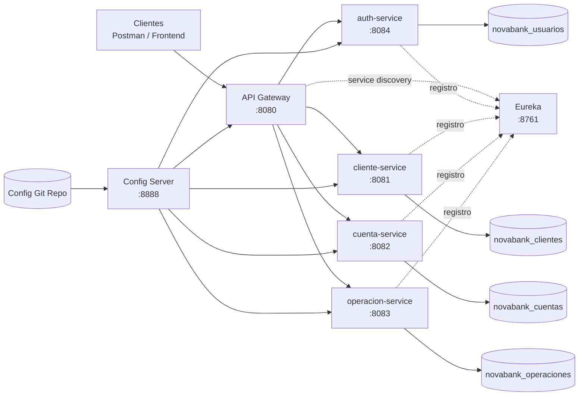
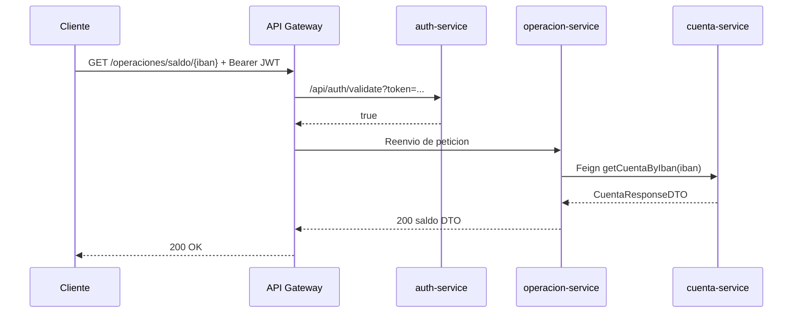
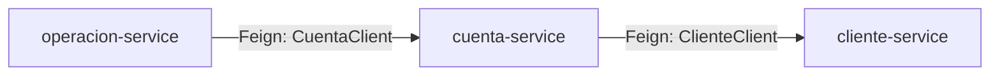
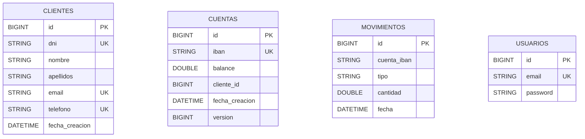

# NovaBank - Plataforma de Microservicios (Modulo 4)

NovaBank es un backend bancario migrado desde una arquitectura monolitica hacia una arquitectura de microservicios sincronos, con seguridad centralizada, descubrimiento de servicios y configuracion externalizada.

## 1. Contexto de migracion

- Modulo 1: CLI + estructuras en memoria.
- Modulo 2: CLI + JDBC + PostgreSQL.
- Modulo 3: Monolito REST con Spring Boot.
- Modulo 4 (actual): sistema distribuido con servicios independientes, API Gateway, Service Discovery y patrones de resiliencia.

## 2. Topologia de servicios

| Servicio | Puerto | Rol | Responsabilidad | Propiedad de datos |
|---|---:|---|---|---|
|  | 8761 | Infraestructura | Registro y descubrimiento de servicios | N/A |
|  | 8888 | Infraestructura | Configuracion centralizada por entorno | N/A |
|  | 8080 | Infraestructura | Punto unico de entrada, enrutado y filtro JWT | N/A |
|  | 8084 | Seguridad | Autenticacion, emision y validacion de token | `novabank_usuarios` |
|  | 8081 | Negocio | Gestion del ciclo de vida de clientes | `novabank_clientes` |
|  | 8082 | Negocio | Gestion de cuentas y saldo | `novabank_cuentas` |
|  | 8083 | Negocio | Depositos, retiros, transferencias y movimientos | `novabank_operaciones` |

## 3. Stack tecnologico

| Capa | Tecnologia + version | Notas |
|---|---|---|
| Lenguaje |  | Baseline del proyecto |
| Framework core |  | Parent BOM |
| Ecosistema cloud |  | Discovery, Config, Gateway, OpenFeign |
| Descubrimiento |  | Resolucion dinamica de endpoints |
| Configuracion centralizada |  | Config remota desde Git |
| Edge/API |  | Ruteo y filtro de autenticacion |
| Comunicacion entre servicios |  | Clientes HTTP declarativos |
| Resiliencia |  | Tolerancia a fallos y reintentos |
| Seguridad |  | JWT stateless |
| Persistencia |  | Una BD por servicio |
| Base de datos runtime |  | Aislamiento por contexto |
| Base de datos testing |  | Pruebas en memoria |
| Testing |  | Unit, slice, integracion y contrato |

## 4. Diagramas de arquitectura

### 4.1 Arquitectura global



### 4.2 Flujo de peticion autenticada



### 4.3 Dependencias entre servicios (sincrono)



### 4.4 Modelo ER (database-per-service)



## 5. API Gateway y seguridad

Las rutas se centralizan en `C:\novabank-config-repo\api-gateway.yml`.

| Route ID | Path Predicate | Target URI | Filtro |
|---|---|---|---|
| `auth-service-route` | `/api/auth/**` | `lb://auth-service` | ninguno |
| `cliente-service-route` | `/clientes`, `/clientes/**` | `lb://cliente-service` | `AuthenticationFilter` |
| `cuenta-service-route` | `/cuentas`, `/cuentas/**` | `lb://cuenta-service` | `AuthenticationFilter` |
| `operacion-service-route` | `/operaciones/**`, `/consultas/**` | `lb://operacion-service` | `AuthenticationFilter` |

Flujo JWT:

1. El cliente obtiene token con `POST /api/auth/login`.
2. El cliente envia `Authorization: Bearer <jwt>` al Gateway.
3. El Gateway valida el token contra `auth-service /api/auth/validate`.
4. Si es valido, enruta al microservicio destino; si no, responde `401`.

## 6. Estrategia de resiliencia

Configuracion actual (desde Config Server):

- `cuenta-service` protege llamadas a `cliente-service` con Circuit Breaker + Retry.
- `operacion-service` protege llamadas a `cuenta-service` con Circuit Breaker + Retry.
- Los Feign clients incorporan fallback para degradacion controlada.

Evidencia esperada en la entrega:

1. Respuesta normal con dependencia activa.
2. Respuesta de fallback con dependencia detenida.
3. Recuperacion automatica tras reactivar la dependencia.

## 7. Testing y cobertura actual

Tipos de pruebas implementadas:

- Unitarias (servicios) con Mockito.
- Repositorio con `@DataJpaTest` + H2.
- Controlador con `@WebMvcTest` + MockMvc.
- Integracion con `@SpringBootTest`.
- Contrato Feign con WireMock.

Comando usado en este entorno:

```bash
mvn -pl cliente-service,cuenta-service,operacion-service -DforkCount=0 test
```

Resultado validado:

- `cliente-service`: 22 tests
- `cuenta-service`: 22 tests
- `operacion-service`: 24 tests
- Total: 68 tests (`BUILD SUCCESS`)

## 8. Guia de ejecucion local

Orden recomendado de arranque:

1. `eureka-server`
2. `config-server`
3. `auth-server`
4. `cliente-service`
5. `cuenta-service`
6. `operacion-service`
7. `api-gateway`

Notas:

- Config Server espera el repo en `C:/novabank-config-repo/`.
- Cada servicio consume configuracion remota y se registra en Eureka.
- El acceso externo debe realizarse por `api-gateway`.

NovaBank Modulo 4 consolida una migracion realista hacia microservicios: separacion por contexto, infraestructura compartida, contratos entre servicios y resiliencia ante fallos parciales.
