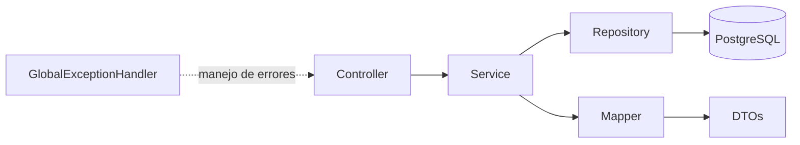

# NovaBank API REST - Modulo 3

<p align="center">
  
  
  
  
</p>

<p align="center">
  
  
  
  
</p>

Backend de un banco digital desarrollado como una API REST segura, documentada y orientada a buenas practicas empresariales.

## Resumen Ejecutivo

NovaBank ha evolucionado de una aplicacion de consola a un backend REST profesional con autenticacion JWT stateless, arquitectura por capas y validaciones robustas.

- API bajo contexto ` /api `
- Seguridad con Spring Security + JWT
- Persistencia con JPA/Hibernate
- Documentacion viva con Swagger/OpenAPI
- Cobertura de pruebas en capas clave del sistema

## Stack Tecnologico

| Componente | Tecnologia |
|---|---|
| Lenguaje | Java 17 |
| Framework | Spring Boot 4.0.6 |
| Base de datos (Produccion) | PostgreSQL |
| Base de datos (Testing) | H2 en memoria |
| Persistencia | Spring Data JPA (Hibernate) |
| Seguridad | Spring Security + JWT 0.12.6 |
| API Docs | Swagger / OpenAPI 3 |
| Build Tool | Maven |
| Utilidades | Lombok |
| Testing | JUnit 5 + Mockito |

## Arquitectura y Diseno

### Arquitectura por capas

`Controller -> Service -> Repository -> Model`

### Diagrama de alto nivel



### Patrones y decisiones tecnicas

- Uso de **DTOs** para desacoplar el contrato HTTP del modelo de dominio.
- Uso de **Mappers** para conversion entre Entidades y DTOs.
- Manejo centralizado de errores con **GlobalExceptionHandler**.
- API stateless para facilitar escalabilidad horizontal.

### Errores controlados

- `404 Not Found`
- `409 Conflict` (ej. saldo insuficiente)

## Requisitos Previos

- Java 17
- Maven
- PostgreSQL instalado y activo

## Puesta en Marcha

1. Configura credenciales en `src/main/resources/application.yml`:
    - `spring.datasource.url`
    - `spring.datasource.username`
    - `spring.datasource.password`

2. Inicia la aplicacion:

```bash
mvn spring-boot:run
```

## Seguridad JWT: Flujo de Acceso

1. Autenticar usuario:
    - `POST /api/auth/login`
    - o `POST /api/auth/registro`

2. Obtener token JWT en la respuesta.

3. Consumir endpoints privados enviando:

```http
Authorization: Bearer <token>
```

## Endpoints Principales

### Publicos

- `POST /api/auth/login`
- `POST /api/auth/registro`
- `GET /api/swagger-ui/index.html`
- `GET /api/v3/api-docs`

### Privados

**Clientes** (`/api/clientes`)
- `POST /api/clientes`
- `GET /api/clientes`
- `GET /api/clientes/{id}`
- `GET /api/clientes/dni/{dni}`
- `DELETE /api/clientes/{id}`

**Cuentas** (`/api/cuentas`)
- `POST /api/cuentas?clienteId={id}`
- `GET /api/cuentas/cliente/{idCliente}`
- `GET /api/cuentas/cliente/iban/{iban}`

**Operaciones** (`/api/operaciones`)
- `POST /api/operaciones/deposito`
- `POST /api/operaciones/retiro`
- `POST /api/operaciones/transferencia`

**Consultas** (`/api/consultas`)
- `GET /api/consultas/{id}/movimientos`
- `GET /api/consultas/saldo/{iban}`

## Documentacion de API

Con el servicio levantado:

- Swagger UI: `http://localhost:8080/api/swagger-ui/index.html`

## Testing y Calidad

La solucion contempla:

- Pruebas unitarias con Mockito
- Pruebas de repositorio con `@DataJpaTest` + H2
- Pruebas de controlador con `@WebMvcTest`
- Pruebas de integracion con `@SpringBootTest`

Ejecucion completa:

```bash
mvn clean test
```

---

<p align="center">
  <strong>NovaBank</strong> · API REST segura para banca digital
</p>
